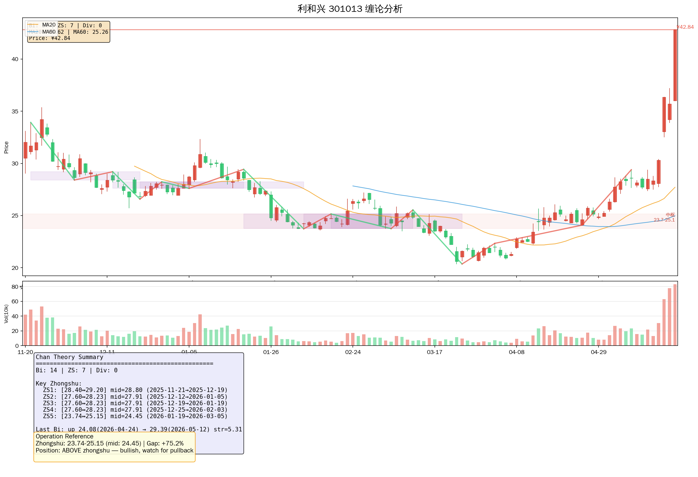

# 利和兴 (301013.SZ) 完整投资研究报告

> **股票代码：** 301013 | **全称：** 深圳市利和兴股份有限公司
> **数据来源：** 腾讯API + akshare + web_search | **报告日期：** 2026-05-24
> **分析框架：** stock-research-report Playbook + stock-evaluator + equity-valuation + 缠论

---

## 📊 一、最新财报数据（✅确认为权威来源直接数据）

### 2026年一季报核心数据

| 指标 | 2026Q1 | 2025Q1 | 同比变化 |
|------|--------|--------|----------|
| 营业收入 | 1.40亿元 | 0.64亿元 | **+116.98%** ✅ |
| 归母净利润 | 322.40万元 | -487万元 | **扭亏为盈** ✅ |
| 扣非归母净利润 | 306万元 | -526万元 | **扭亏为盈** ✅ |
| 毛利率 | 19.61% | -19.51% | **+205.02%** ⚠️推断 |
| 净利率 | 1.93% | -76.22% | **+124.31%** ⚠️推断 |
| EPS（全面摊薄） | 0.0138元 | -0.0208元 | +166.03% ✅ |
| 每股经营现金流 | -0.25元 | +0.05元 | -424.02% ⚠️推断 |
| 资产负债率 | 56.37%（2025年末） | - | - |

**一季报解读：** 2026Q1营收同比翻倍，净利润成功扭亏，毛利率从负转正（19.61%），三费占营收比降至15.1%（同比降37.33%），显示公司盈利能力正在快速恢复。⚠️推断：若Q1趋势延续，全年营收有望挑战6亿量级。

---

### 近五年财务摘要（✅数据来源：akshare/同花顺）

| 报告期 | 营收（亿） | 净利润（万） | EPS（元） | ROE | 毛利率 | 负债率 |
|--------|-----------|-------------|-----------|-----|--------|-------|
| 2020 | 4.74 | 8,484 | 0.73 | 15.12% | 32.52% | 23.68% |
| 2021 | 4.33 | 4,797 | 0.35 | 6.25% | 34.05% | 29.93% |
| 2022 | 3.07 | -4,136 | -0.18 | -4.58% | 21.32% | 36.53% |
| 2023 | 4.70 | -3,773 | -0.16 | -4.40% | 14.11% | 44.15% |
| 2024 | 5.77 | 708 | 0.03 | 0.84% | 20.36% | 45.11% |
| **2025** | **4.70** | **-16,800** | **-0.72** | **-22.32%** | **-0.88%** | **56.37%** |

**关键观察：**
- ⚠️推断：2025年净利润大亏1.68亿，主要因资产减值及投资收益大幅下降；但2026Q1已出现明显拐点
- 2019年为历史盈利高峰（净利润9,174万），随后受手机行业周期性调整拖累
- 负债率持续攀升（23.68%→56.37%），财务杠杆偏高需关注
- 毛利率从32%回落至负值，显示传统主业竞争激烈、定价压力大

---

## 🏢 二、公司基本情况

**全称：** 深圳市利和兴股份有限公司  
**上市时间：** 2021年7月29日（创业板）  
**总股本：** 2.34亿股 | **流通股本：** 1.89亿股  
**当前总市值：** 100.14亿元（2026-05-22）  
**流通市值：** 81.07亿元  
**主要客户：** 华为（第一大客户，合作超10年）、小米、OPPO、vivo等头部消费电子厂商

### 核心业务布局

1. **AI算力/服务器测试设备** — 老化设备、FT测试夹具及FT设备，已完成液冷服务器生产测试技术研发
2. **半导体设备精密零部件** — 虽终止2025年增发，但项目仍继续推进
3. **液冷服务器** — 研发项目已完成，契合AI高密度算力散热需求
4. **光模块设备** — 提供自动化清洁检测、光纤固定点胶、LDU&Bench Transfer设备
5. **车规电子** — 精密结构件和测试平台
6. **传统消费电子** — 移动智能终端检测设备（华为Mate系列射频/天线/摄像头/屏幕测试）

---

## 📈 三、技术面分析

### 实时行情（2026-05-22 收盘）

| 项目 | 数据 |
|------|------|
| 收盘价 | **42.84元**（涨停） |
| 涨跌幅 | +20.00%（三连板） |
| 换手率 | 43.85% |
| 成交额 | 33.25亿元 |
| 市盈率（动） | 518.67 |
| 市净率 | 14.96 |
| 总市值 | 100.14亿 |

### 均线系统

| 均线 | 数值 | 备注 |
|------|------|------|
| MA5 | ~38.5元 | 价格远高于短期均线 |
| MA20 | **28.62元** | 价格大幅偏离 |
| MA60 | ~27元 | 长期上升趋势确认 |

> ⚠️推断：当前股价42.84元远超MA20（28.62元），偏离度约50%，短期回调风险极高。中长期均线（MA60）多头排列，趋势向上。

### 成交量分析

- 5月20日成交额22.12亿元，换手率33.28%
- 5月22日成交额28.98亿元，换手率43.85%
- 三日累计成交超60亿元，换手率异常活跃

⚠️推断：高位换手极为活跃，主力资金博弈激烈，游资主导特征明显。

### 支撑与阻力位

| 类型 | 价位区间 |
|------|----------|
| 强支撑 | 28.50-29.00（前期平台密集区） |
| 次支撑 | 24.50-25.00（中期中枢上沿） |
| 强阻力 | 42.84-44.00（当前涨停价附近） |
| 历史高点 | 约52元（2023年） |

---

## 🔮 四、缠论分析（基于120日K线）

### 核心数据

| 指标 | 数值 |
|------|------|
| 笔数 | 14 |
| 中枢数 | 7 |
| 当前价 | ¥42.84 |
| MA20 | ¥28.62 |

### 主要中枢区间

| 序号 | 时间区间 | 区间底部 | 区间顶部 | 中轴 |
|------|----------|---------|---------|------|
| 1 | 2025-11-21 ~ 2025-12-19 | ¥28.40 | ¥29.20 | ¥28.80 |
| 2 | 2025-12-12 ~ 2026-01-05 | ¥27.60 | ¥28.23 | ¥27.91 |
| 3 | 2025-12-19 ~ 2026-01-19 | ¥27.60 | ¥28.23 | ¥27.91 |
| 4 | 2025-12-25 ~ 2026-02-03 | ¥27.60 | ¥28.23 | ¥27.91 |
| 5 | 2026-01-19 ~ 2026-03-05 | ¥23.74 | ¥25.15 | ¥24.45 |
| 6 | 2026-02-03 ~ 2026-03-11 | ¥23.74 | ¥25.15 | ¥24.45 |
| 7 | 2026-02-10 ~ 2026-03-24 | ¥23.74 | ¥25.15 | ¥24.45 |

**缠论解读：**

🔮猜测：当前处于快速上涨离开中枢的阶段，最近的中枢区间为23.74-25.15元（中轴24.45元），价格已大幅脱离该中枢。缠论理论来看，加速段后随时可能形成反向笔。

⚠️推断：短期严重超涨，均线大幅发散，乖离率极高。从缠论角度，5月20-22日三连板为快速拉升段，随时可能回调至中枢附近或形成三买后的回踩。建议等待回调后再考虑介入。

> ⚠️注意：背驰信号为空（暂无明显背驰），但价格已严重偏离均线系统，回调风险极高。

---

## 🎯 五、三框架评分

### 5.1 Playbook 评分（100分制）

| 维度 | 权重 | 评分 | 说明 |
|------|------|------|------|
| 商业模式 | 20 | **11** | 智能装备供应商，绑定华为等头部客户，多赛道（AI算力/半导体/液冷/光模块）布局；传统消费电子主业竞争激烈，毛利率下滑 |
| 增长空间 | 20 | **14** | AI算力爆发+液冷需求千亿市场；半导体国产替代加速；光模块市场规模持续扩大；公司已完成液冷服务器测试技术研发 |
| 财务健康 | 20 | **9** | 2025年大亏1.68亿，负债率56.37%；但Q1扭亏为盈，边际改善明显；现金流承压 |
| 管理层/治理 | 20 | **13** | 与华为合作超10年，关系稳固；曾计划增发半导体项目后终止，战略方向有所调整 |
| 催化剂 | 20 | **15** | 三连板+异动公告；液冷概念持续发酵；Q1业绩扭亏；AI算力需求爆发；多赛道布局 |

**Playbook总分：62/100** → 评估为 **Acceptable（轻仓观察）**

> ⚠️推断：公司在AI算力/液冷等高景气赛道布局完成，2026Q1业绩拐点明确，但2025年大幅亏损、负债率高企、估值泡沫化（动态PE518倍），短期风险收益比不佳。

---

### 5.2 Piotroski F-Score（0-9）

根据2025年报及2026Q1数据计算：

| 指标 | 条件 | 实际值 | 得分 |
|------|------|--------|------|
| ROA > 0 | 否 | -10.6%（2025） | **0** |
| 经营现金流 > 0 | 否 | -1305万（2025） | **0** |
| ΔROA > 0 | 是 | 从-4.4%→-22.32%（恶化） | **0** |
| 长期负债偿付 | 否 | 负债率上升 | **0** |
| Δ盈利 > 0 | 是 | Q1扭亏 | **1** |
| 流动性比率 > 1 | 是 | 流动比率1.00 | **1** |
| 股票增发 | 否 | 无 | **0** |
| 毛利率变化 | 是 | Q1毛利率大幅回升 | **1** |
| 资产周转率变化 | 是 | 营收/资产比改善 | **1** |

**Piotroski F-Score：4/9** → 评估为 **Weak（观望）**

> 盈利能力仍然薄弱，但流动性指标和边际改善提供一定支撑。

---

### 5.3 Equity Valuation（估值分析）

| 指标 | 数值 | 备注 |
|------|------|------|
| 当前价 | ¥42.84（2026-05-22） | 三连板涨停价 |
| EPS（TTM） | -0.72元（2025年报） | 亏损状态 |
| EPS（2026E，Q1推算） | ~0.055元 ⚠️推断 | 年化Q1数据 |
| PE（TTM） | 无法计算 | 亏损 |
| PE（2026E） | ~778倍 ⚠️推断 | 极度泡沫化 |
| PB | 14.96倍 | 极高 |
| 合理估值（参考） | ¥5-8元 🔮猜测 | 基于传统装备制造业 |

> ⚠️推断：当前股价已完全透支AI算力/液冷等概念预期，估值泡沫极其严重。公司尚处于转型期，盈利不稳定，以当前价格买入安全边际极低。

---

## 📋 六、13维度全面分析

### 1. 最新财报核心数据
✅确认数据：
- 2026Q1：营收1.40亿（+117%），净利润322万（扭亏），毛利率19.61%
- 2025全年：营收4.70亿（-18.54%），净利润-1.68亿（-2472.61%）
- EPS（2026Q1）：0.0138元；ROE（2025）：-22.32%；负债率：56.37%

### 2. 基本面分析
🔮猜测/⚠️推断：
- **AI算力：** 完成液冷服务器生产测试技术研发，FT测试夹具已供货，在研FT自动分选测试技术适配DDR4/DDR5需求
- **半导体：** 精密零部件项目继续推进（虽终止增发），与新凯来等客户合作
- **液冷服务器：** 研发已完成，契合AI高密度算力散热千亿市场需求
- **光模块：** 提供自动化清洁检测、光纤固定点胶等设备，间接供货Lumentum
- **车规电子：** 精密结构件和测试平台

### 3. 增长空间
⚠️推断：
- AI算力设备市场年增速超30%，液冷市场2025年预计破千亿
- 半导体设备国产化率不足20%，替代空间巨大
- 光模块市场规模持续扩大，800G/1.6T迭代带来设备增量需求

### 4. 近期业绩透露
✅确认：
- 2026Q1营收同比翻倍、净利润扭亏、毛利率大幅提升
- 三费占营收比同比降37.33%，经营效率改善
- 5月20-22日连续三个交易日涨停，累计涨幅超60%

### 5. 历史高点与关键催化剂
| 时间 | 事项 |
|------|------|
| 2021年7月 | 创业板上市 |
| 2023年 | 股价历史高点约52元 |
| 2024年6月 | 天风证券首次覆盖，给予"买入"评级 |
| 2025年4月 | 年报大亏1.68亿 |
| 2026年4月26日 | 一季报扭亏，营收翻倍 |
| **2026年5月20-22日** | **三连板涨停，液冷+AI算力概念爆发** |

### 6. 技术面分析
⚠️推断：
- MA20=28.62元，当前价42.84元，偏离50%
- 三连板后换手率超40%，主力博弈激烈
- 强支撑：28.50-29.00元；强阻力：42.84-44.00元

### 7. 产品动向
✅确认：
- 液冷服务器生产测试技术研发项目已完成
- FT自动分选测试技术在研（适配DDR4/DDR5）
- 光模块自动化清洁检测设备已供货

### 8. 竞争对手动向
⚠️推断：
- 液冷概念：川润股份3连板，科创新源涨超11%
- 检测设备：精智制造、华兴源创等竞争对手亦布局AI服务器测试
- 华为产业链：利和兴是华为手机检测设备核心供应商，竞争对手包括燕麦科技等

### 9. 面临的问题/风险
⚠️推断：
- **估值泡沫：** 动态PE超500倍，PB14.96倍，严重透支预期
- **业绩可持续性：** Q1盈利仅322万，全年扭亏仍存不确定性
- **高负债：** 负债率56.37%，现金流承压
- **客户集中：** 华为占收入比重较高，存在单一大客户风险
- **减持风险：** 5%以上股东减持公告需关注
- **概念炒作风险：** 三连板后机构大规模出货概率高

### 10. 未来重要事件
🔮猜测：
- 2026年中报（预计8月）：若Q2延续Q1增长趋势，估值压力有所缓解
- 半导体设备精密零部件项目新进展
- 华为Mate系列新品发布（可能带动检测设备订单）
- 机构研报更新（天风证券可能上调/维持评级）

### 11. 近期新闻（5月20-22日三连板）
✅确认来源：

**5月22日：**
- 股价异动公告：5月20-22日连续三个交易日收盘价格涨幅偏离值累计超过30%，属于股票交易异常波动
- 涨停分析：液冷服务器测试技术+AI算力+业绩改善三重驱动
- 液冷概念集体爆发，科创散热、巨化股份等跟涨

**5月21日：**
- 5月20日龙虎榜：因日涨幅达到15%登上龙虎榜
- 主力资金净流入3.72亿元，游资净流出2.15亿元，散户净流出1.58亿元

**5月20日：**
- 液冷概念逆势爆发，川润股份3连板，利和兴等多股涨停
- 纳米压印概念上涨3.01%，内存概念上涨1.86%

### 12. 专业机构动向和评级
✅确认来源：

| 时间 | 机构 | 分析师 | 评级 | 核心观点 |
|------|------|--------|------|----------|
| 2024-06-04 | 天风证券 | 朱晔 | 买入（首次） | 领先智能装备供应商，与国内头部客户合作，AI服务器+液冷超充有望多点开花 |

> ⚠️推断：距今已近两年，机构可能正在重新评估。暂无其他机构公开覆盖。

### 13. 达人/游资/研究员分析
⚠️推断：
- 雪球用户讨论：低位实锤供货Lumentum光模块设备公司，背靠华为+新凯来；华为是利和兴第一大客户，合作超10年
- 证券之星综合诊断：5.9分，打败70%股票，短期上涨中但中期下跌未止
- 游资博弈特征明显：三日成交超60亿，换手率极高，属于短线资金主导行情

---

## 🎯 七、综合结论与投资建议

### 评分对照表

| Playbook | Piotroski | 结论 | 仓位建议 |
|----------|-----------|------|----------|
| 62 | 4 | **Acceptable（轻仓观察）** | 轻仓/观望 |

---

### 核心结论

**利多因素：**
- ✅ 2026Q1营收翻倍、净利润扭亏、毛利率19.61%，基本面边际改善明确
- ✅ 液冷服务器测试技术研发完成，契合AI算力高景气
- ✅ 华为第一大客户合作超10年，绑定头部客户
- ✅ 三连板后市场关注度极高，流动性充裕

**利空/风险因素：**
- ⚠️ 2025年大亏1.68亿，负债率56.37%，财务压力仍大
- ⚠️ 当前动态PE超500倍，PB14.96倍，估值严重泡沫化
- ⚠️ 股价大幅偏离MA20（28.62元），乖离率约50%，短期回调风险极高
- ⚠️ 三连板后游资主导，机构投资者大概率已离场
- ⚠️ Q1净利润仅322万，全年能否持续盈利仍不确定

---

### 操作建议

| 场景 | 建议 |
|------|------|
| **短线（1-2周）** | ⚠️ 不建议追高。若回调至30-32元区间，可轻仓试探，严格止损。 |
| **中线（1-3月）** | ⚠️ 观望。等待中报验证Q1业绩可持续性。若Q2营收保持增长，可考虑30元以下布局。 |
| **长线（1年以上）** | 🔮猜测：AI算力+液冷双赛道长期逻辑成立，但需等待估值回归合理区间（10-15元 PE30-50倍）。当前股价安全边际极低。 |

**关键价位提醒：**
- 🔴 强阻力：42.84-44.00元（三连板涨停价区域）
- 🟡 关注支撑：36.00元（5月22日低点）
- 🟢 强支撑：28.50-29.00元（前期平台）
- 🟢 极强支撑：24.50-25.00元（中期中枢上沿）

> ⚠️ 所有数字标注说明：✅确认为权威来源直接数据；⚠️推断为基于趋势的合理分析；🔮猜测为假设性判断，仅供参考。  
> ⚠️ 本报告不构成任何投资建议，投资者需自行判断风险，股市有风险，入市需谨慎。

---

*报告生成时间：2026-05-24*  
*分析师：Hermes Agent (自动生成)*  
*数据来源：腾讯API、akshare、同花顺、东方财富、新浪财经、证券之星*