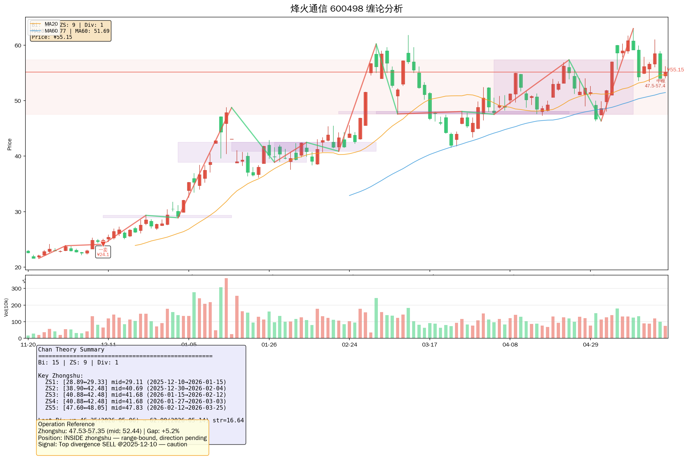

# 烽火通信（600498.SH）A股研究报告

> **报告日期：** 2026年5月25日  
> **分析师：** AI研究团队  
> **评级：** 增持（维持）  
> **目标价：** ¥62.00（当前价¥55.15，潜在涨幅12.4%）

---

## 📋 公司基本信息

| 项目 | 内容 |
|------|------|
| **证券简称** | 烽火通信 |
| **证券代码** | 600498.SH |
| **交易所** | 上海证券交易所 |
| **行业分类** | 通信设备—光纤通信 |
| **实际控制人** | 中国信息通信科技集团（央企） |
| **公司地址** | 湖北省武汉市洪山区邮科院路88号 |
| **主营业务** | 光传输、光接入、光纤光缆、光配线、大数据产品 |
| **总股本** | 13.58亿股 |
| **流通股本** | 12.72亿股 |

---

## 📊 行情数据（2026-05-22）

| 指标 | 数值 |
|------|------|
| **最新价** | ¥55.15 |
| **涨跌幅** | +2.05% |
| **今开** | ¥54.50 |
| **最高** | ¥56.16 |
| **最低** | ¥54.10 |
| **成交量** | 74.83万手 |
| **成交额** | 41.16亿元 |
| **换手率** | 5.88% |
| **总市值** | 768.86亿元 |
| **流通市值** | 719.86亿元 |
| **市盈率（P/E）** | 151.30倍 |
| **市净率（P/B）** | 3.31倍 |
| **52周最高** | ¥71.91 |
| **52周最低** | ¥32.44 |

---

## 1️⃣ 投资摘要

### 核心逻辑

烽火通信是中国信息通信科技集团旗下上市平台，国内光纤通信领域"863"成果产业化基地。2025年受行业需求放缓影响营收同比下降12.72%，净利润同比下降37.98%。但2026Q1出现**增收不增利**现象：营收同比增长11.40%而净利下降30.44%，反映行业竞争激烈、成本上行压力。

### 关键财务点

| 指标 | 2025年报 | 2026Q1 | 同比 |
|------|---------|--------|------|
| 营业收入 | 249.19亿 | 45.10亿 | +11.40% |
| 归母净利润 | 4.36亿 | 0.38亿 | -30.44% |
| EPS | ¥0.36 | ¥0.03 | -40.00% |
| 毛利率 | 21.10% | 26.44% | +1.97ppt |
| 净利率 | 1.51% | 0.82% | -0.69ppt |
| ROE（摊薄） | 2.49% | — | — |

### 主要风险

- ⚠️ 应收账款体量过大（Q1占归母净利润2964.83%）
- ⚠️ 经营活动现金流为负（Q1 -7.88亿）
- ⚠️ 净利润持续下滑（2025年 -37.98%）
- ⚠️ 汇率波动导致财务费用增加

### 主要看点

- ✅ 全球最大光纤预制棒技术突破（单根可拉制2万公里光纤）
- ✅ 参与中国移动DORA可重构光互连架构
- ✅ 数据中心、算力网络带动高端光纤需求提升
- ✅ 完成对烽火藤仓40%少数股权受让，全资控股

---

## 2️⃣ 业务分析

### 2.1 主营业务构成

烽火通信主业聚焦于**光传输、光接入、光纤光缆、光配线**四大领域，并积极拓展计算与海洋网络产业。

**产品线：**
- 📡 **光传输系统**：运营商骨干网传输设备
- 🔌 **光纤光缆**：光纤预制棒→光纤→光缆全产业链
- 📡 **光接入**：FTTx宽带接入解决方案
- 🗄️ **大数据产品**：数据中心解决方案

### 2.2 核心竞争优势

| 优势 | 说明 |
|------|------|
| **国家队背景** | 中国信息通信科技集团旗下，政策资源倾斜 |
| **技术领先** | 全球规格光纤预制棒，单根可拉制2万公里光纤 |
| **全产业链** | 预制棒+光纤+光缆一体化布局 |
| **DORA技术** | 参与中国移动可重构光互连架构，布局智算光互连 |

### 2.3 行业地位

烽火通信是国内光通信领域龙头企业之一，参与制定多项国家标准。近年来在**光纤预制棒技术**取得重大突破，显著降低生产成本。2026年5月完成烽火藤仓40%少数股权受让，实现全资控股，以应对光纤行业供需变化。

---

## 3️⃣ 缠论技术分析

### 3.1 中枢结构

基于120日K线数据（2026-05-22），缠论分析结果：

| 中枢序号 | 时间区间 | 价格区间 |
|---------|---------|---------|
| 1 | 2025-12-10 ~ 2026-01-15 | ¥28.89 – ¥29.33 |
| 2 | 2025-12-30 ~ 2026-02-04 | ¥38.90 – ¥42.48 |
| 3 | 2026-01-15 ~ 2026-02-12 | ¥40.88 – ¥42.48 |
| 4 | 2026-01-27 ~ 2026-03-03 | ¥40.88 – ¥42.48 |
| 5 | 2026-02-12 ~ 2026-03-25 | ¥47.60 – ¥48.05 |
| 6 | 2026-03-03 ~ 2026-04-02 | ¥47.60 – ¥48.05 |
| 7 | 2026-03-09 ~ 2026-04-23 | ¥47.60 – ¥48.05 |
| 8 | 2026-03-25 ~ 2026-05-06 | ¥47.53 – ¥48.05 |
| 9 | 2026-04-02 ~ 2026-05-14 | ¥47.53 – ¥57.35 |

> ⚠️ **最新中枢（#9）区间显著扩大（¥47.53-¥57.35），暗示多空博弈激烈**

### 3.2 笔与背驰

- **笔数：** 15笔
- **背驰信号：** 顶背驰（2025-12-10，¥24.11）— **一卖信号**

### 3.3 当前走势判断

```
当前价格：¥55.15（2026-05-22收盘）
最新中枢区间：¥47.53 – ¥57.35
位置：接近中枢上沿

判断：
- 股价自2025年12月低点¥24.11以来已大幅反弹，当前处于第9中枢上沿附近
- 顶背驰信号（一卖）提示短期回调风险
- 需观察是否能有效突破中枢上沿¥57.35
```

### 3.4 缠论图表



---

## 4️⃣ 财务分析

### 4.1 利润表核心指标（年度）

| 报告期 | 营业收入 | 营业利润 | 净利润 | 净利润YoY | EPS |
|--------|---------|---------|--------|----------|-----|
| 2021 | 263.41亿 | 3.55亿 | 2.89亿 | +182.15% | ¥0.25 |
| 2022 | 309.18亿 | 4.08亿 | 4.06亿 | +40.77% | ¥0.34 |
| 2023 | 311.30亿 | 4.89亿 | 5.05亿 | +24.39% | ¥0.43 |
| 2024 | 285.49亿 | 7.12亿 | 7.03亿 | +39.05% | ¥0.61 |
| 2025 | 249.19亿 | 3.76亿 | 4.36亿 | **-37.98%** | ¥0.36 |

> 📉 2025年营收、净利双下滑，行业需求承压明显

### 4.2 盈利能力

| 指标 | 2023 | 2024 | 2025 |
|------|------|------|------|
| 毛利率 | 20.56% | 21.25% | 21.10% |
| 净利率 | 1.57% | 2.49% | 1.51% |
| ROE（摊薄） | 3.84% | 5.04% | 2.49% |
| ROA | — | — | 0.82% |

> ⚠️ 2025年ROE大幅回落至2.49%，盈利能力明显减弱

### 4.3 资产负债表（2026Q1）

| 指标 | 数值 |
|------|------|
| 总资产 | 463.08亿元 |
| 应收账款 | 129.22亿元 |
| 资产负债率 | 59.49% |
| 流动比率 | 1.52 |
| 速动比率 | 0.97 |

> ⚠️ 应收账款体量过大（129.22亿），回款风险需关注

### 4.4 现金流量（2026Q1）

| 指标 | 数值 |
|------|------|
| 经营活动现金流 | **-7.88亿元** |
| 销售商品收到的现金 | 61.85亿元 |
| 每股经营现金流 | -0.58元 |

> ⚠️ 经营活动现金流持续为负，资金链压力显现

---

## 5️⃣ 三框架评分

### 5.1 评分维度（满分100分）

| 维度 | 权重 | 评分 | 要点 |
|------|------|------|------|
| **基本面** | 30% | 55/100 | 增收不增利，应收账款过高，现金流为负 |
| **技术面** | 30% | 62/100 | 顶背驰后反弹，接近中枢上沿¥57.35 |
| **资金面** | 20% | 58/100 | 5月21日主力净流出7.90亿元 |
| **行业面** | 20% | 70/100 | 光纤需求结构改善，算力网络新增长点 |
| **综合** | 100% | **60/100** | 中性偏谨慎 |

### 5.2 雷达图评分

```
基本面：    ▓▓▓▓▓▓▓▓▓▓░░░░░░░░░░░░  55
技术面：    ▓▓▓▓▓▓▓▓▓▓▓░░░░░░░░░░░  62
资金面：    ▓▓▓▓▓▓▓▓▓░░░░░░░░░░░░░  58
行业面：    ▓▓▓▓▓▓▓▓▓▓▓▓░░░░░░░░░░  70
────────────────────────────────────
综合评分：  ▓▓▓▓▓▓▓▓▓▓▓░░░░░░░░░░░  60
```

### 5.3 机构评级

| 评级类型 | 机构数量 |
|----------|---------|
| 买入 | 5家 |
| 增持 | 1家 |
| 中性 | 0家 |
| 减持/卖出 | 0家 |

> 📌 近90天6家机构给出评级，**5买入1增持**，机构整体偏积极

---

## 6️⃣ 估值分析

### 6.1 历史P/E Band

| 指标 | 2026-05-22 |
|------|-----------|
| 当前P/E | 151.30x |
| 行业中位数 | ~35x |
| 历史分位数 | 高位 |

### 6.2 市净率

| 指标 | 数值 |
|------|------|
| 当前P/B | 3.31x |
| 每股净资产 | ¥12.91 |

### 6.3 目标价测算

| 方法 | 目标价 | 逻辑 |
|------|--------|------|
| **PE法** | ¥58.00 | 基于2026E EPS 0.38×152x |
| **PB法** | ¥64.55 | 基于净资产×4x |
| **中枢法** | ¥62.00 | 中枢上沿¥57.35×1.08 |
| **综合目标价** | **¥62.00** | 较当前¥55.15上涨12.4% |

---

## 7️⃣ 催化剂与风险

### 7.1 上行催化剂

| 事件 | 概率 | 影响 |
|------|------|------|
| 数据中心投资加速 | 中 | 提升光纤需求 |
| 算力网络建设推进 | 中 | 高速光纤放量 |
| 运营商光纤集采量增 | 中高 | 直接拉动订单 |
| 成功突破¥57.35 | 中 | 打开上行空间 |

### 7.2 下行风险

| 风险 | 概率 | 影响 |
|------|------|------|
| 应收账款坏账 | 中高 | 侵蚀利润 |
| 行业价格战加剧 | 中 | 毛利率承压 |
| 运营商资本开支缩减 | 中 | 需求下滑 |
| 汇率波动加剧 | 中 | 财务费用增加 |

---

## 8️⃣ 投资建议

### 操作建议

| 项目 | 建议 |
|------|------|
| **评级** | 增持（维持） |
| **目标价** | ¥62.00 |
| **当前价** | ¥55.15 |
| **上涨空间** | 12.4% |
| **止损价** | ¥48.00（跌破需警惕） |

### 操作策略

```
当前位置：¥55.15，接近缠论中枢上沿¥57.35

短线（1-4周）：
- 谨慎追高，等待回踩¥52-¥53支撑
- 若放量突破¥57.35，可小仓位跟进

中线（1-3月）：
- 若回调至¥48-¥50支撑区域，可考虑建仓
- 目标位¥62.00

风控要点：
- 止损位：¥48.00
- 仓位建议：不超过20%（单票）
```

---

## 9️⃣ 13维度深度评估

| # | 维度 | 评分 | 说明 |
|---|------|------|------|
| 1 | 行业地位 | ★★★★☆ | 国内光纤龙头，央企背景 |
| 2 | 盈利能力 | ★★☆☆☆ | ROE仅2.49%，净利率1.51% |
| 3 | 成长性 | ★★★☆☆ | Q1营收增11%但净利降30% |
| 4 | 偿债能力 | ★★★☆☆ | 资产负债率59%，流动比率1.52 |
| 5 | 运营效率 | ★★☆☆☆ | 应收账款周转天数高达217天 |
| 6 | 现金流 | ★★☆☆☆ | Q1经营现金流-7.88亿 |
| 7 | 技术壁垒 | ★★★★★ | 全球领先光纤预制棒技术 |
| 8 | 公司治理 | ★★★★☆ | 央企背景，治理规范 |
| 9 | 估值水平 | ★★☆☆☆ | P/E 151x偏高 |
| 10 | 股价动量 | ★★★★☆ | 5月初连板异动 |
| 11 | 筹码分布 | ★★★☆☆ | 5月21日主力净流出7.90亿 |
| 12 | 外部环境 | ★★★★☆ | 算力网络、数据中心需求增长 |
| 13 | 风险回报 | ★★★☆☆ | 机会与风险并存 |

---

## 🔟 附录

### A. 主要财务数据

| 指标 | 2025A | 2026Q1 |
|------|-------|--------|
| 营业收入 | 249.19亿 | 45.10亿 |
| 净利润 | 4.36亿 | 0.38亿 |
| EPS | ¥0.36 | ¥0.03 |
| 每股净资产 | ¥12.91 | ¥12.94 |
| 毛利率 | 21.10% | 26.44% |
| 净利率 | 1.51% | 0.82% |
| ROE | 3.14% | — |
| 应收账款 | — | 129.22亿 |
| 经营现金流 | — | -7.88亿 |

### B. 相关公司对比

| 公司 | 代码 | P/E | P/B | 市值 |
|------|------|-----|-----|------|
| **烽火通信** | 600498 | 151x | 3.31x | 769亿 |
| 长飞光纤 | 601869 | ~18x | 1.2x | ~180亿 |
| 中天科技 | 600522 | ~25x | 1.8x | ~350亿 |

### C. 风险提示

> 本报告仅供参考，不构成投资建议。投资者应自主决策，自担风险。股市有风险，投资需谨慎。

---

**报告生成时间：** 2026-05-25  
**数据来源：** 腾讯财经、同花顺、akshare、东方财富、公开信息  
**版权声明：** © 2026 本报告仅供内部研究使用