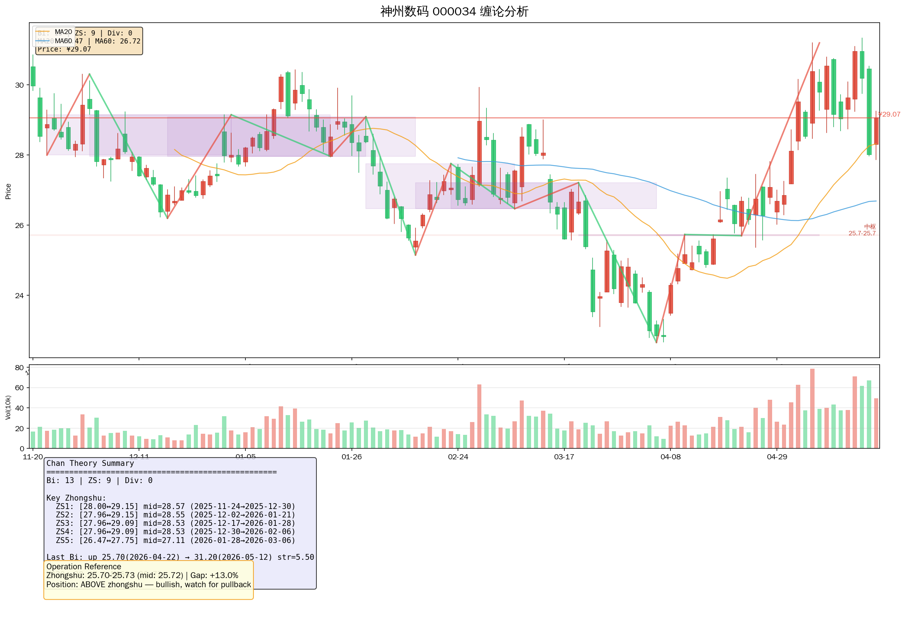

# 神州数码 (000034.SZ) 投资研究报告

> **证券代码**：000034 | **全称**：神州数码集团股份有限公司 | **交易所**：深圳证券交易所
> **数据源**：腾讯API (日K线/实时行情) + akshare (财务数据) + web_search (新闻资讯)
> **报告日期**：2026-05-24 | **报告版本**：v1

---

## 📌 投资摘要

| 指标 | 数值 | 备注 |
|------|------|------|
| 最新价 | ¥29.07 | 2026-05-22收盘价 |
| 涨跌 | +¥1.06 (+3.78%) | 当日涨幅 |
| 52周最高 | ¥56.52 | ⚠️当前较高点回落48.6% |
| 52周最低 | ¥22.66 | 🔮2025年低点附近获得支撑 |
| 市值(总/流通) | 289.63亿 / 242.22亿 | 中大盘 |
| 市净率(PB) | 1.88 | 低于历史中枢 |
| 市盈率(动 PE) | 30.81 | ✅同花顺数据 |
| 每股净资产(BPS) | ¥15.21 | 2025年报 |
| 每股收益(EPS) | ¥0.7711 | 2025年报 |

**一句话逻辑**：华为鲲鹏昇腾核心伙伴，2026Q1营收405亿(+28%)但净利仅增9%，近期因高估值+减持压力从¥42高位暴跌至¥29(跌幅31%)，已回撤至关键技术支撑区域，短线超跌但中期需等待基本面拐点确认。

---

## 一 Business Overview 业务概况

神州数码是中国领先的IT产业整合服务提供商，主营业务涵盖：
- **云计算及数字化转型**：华为鲲鹏/昇腾生态核心合作伙伴，提供、自主品牌神州鲲泰服务器
- **IT分销及增值服务**：传统ICT分销业务稳健
- **国际创新中心(IIC)项目**：深圳地产项目，受房地产行业影响计提减值

**核心看点**：华为计算产业链核心受益标的，2025年受让华为超聚变服务器分销，2026年AI算力需求旺盛推动业务增长。

---

## 二 股权结构与公司动向

| 事项 | 详情 | 日期 |
|------|------|------|
| 分红方案 | 10转4股派0.73元(含税) | 2026-05-18实施 |
| 股权登记日 | 2026-05-18 | ✅确认 |
| 除权除息日 | 2026-05-19 | ✅确认 |
| 股东减持 | 进行中（时间过半进展公告） | 2026-05-12 |
| Q1财报披露 | 2026Q1营收405.57亿(+27.62%)，净利2.36亿(+8.62%) | 2026-04-27 |

⚠️ **关键风险提示**：5月股价从~¥42暴跌至~¥29（跌幅约31%），主要压力来自：
1. 高估值叠加股东减持
2. Q1净利润增速(8.62%)显著低于营收增速(27.62%)，"增收不增利"疑虑
3. 经营活动现金净流入为-24.98亿元(同比下降191.54%)，现金流压力较大

---

## 三 财务分析

### 3.1 利润表核心指标（年度）

| 报告期 | 营收(亿) | 营收增速 | 净利(亿) | 净利增速 | EPS(元) | 毛利率 | 净利率 | ROE |
|--------|----------|----------|----------|----------|---------|--------|--------|-----|
| 2021 | 1223.85 | +32.94% | 2.49 | -60.08% | 0.39 | 3.35% | 0.20% | 4.23% |
| 2022 | 1158.80 | -5.32% | 10.04 | +303% | 1.57 | 3.92% | 0.89% | 14.97% |
| 2023 | 1196.24 | +3.23% | 11.72 | +16.66% | 1.79 | 3.99% | 1.01% | 14.65% |
| 2024 | 1281.66 | +7.14% | 7.53 | **-35.77%** | 1.17 | 4.21% | 0.61% | 8.47% |
| 2025 | 1437.51 | +12.16% | 5.23 | **-30.52%** | 0.77 | 3.40% | 0.39% | 5.05% |

### 3.2 单季度表现（2026Q1）

| 指标 | 2026Q1 | 2025Q1 | 同比变化 |
|------|--------|--------|----------|
| 营业收入 | 405.57亿 | 317.93亿 | **+27.62%** |
| 归母净利润 | 2.36亿 | 2.17亿 | **+8.62%** |
| 每股收益 | 0.34元 | — | — |
| 毛利率 | 3.37% | 3.73% | -0.36pct |
| 经营现金流 | -24.98亿 | +27.29亿 | **转负** |

⚠️ **核心问题**：营收高增长但净利润增速仅个位数，毛利率持续承压（从2024年4.21%降至2025年3.40%），显示IT分销业务竞争激烈、AI投入压制利润。

### 3.3 资产负债表（2025年度）

| 指标 | 2025 | 2024 | 备注 |
|------|------|------|------|
| 每股净资产 | ¥15.21 | ¥13.70 | 稳定增长 |
| 每股资本公积金 | ¥8.02 | ¥6.24 | ⚠️ 大幅提高（分红转增导致） |
| 流动比率 | 1.19 | 1.24 | 略降 |
| 速动比率 | 0.60 | 0.67 | 低于1，偿债能力一般 |
| 资产负债率 | 79.37% | 78.02% | ⚠️ 高杠杆 |
| 产权比率 | 4.12 | 3.83 | 负债水平较高 |

---

## 四  Valuation 估值分析

### 4.1 PE估值法

| 指标 | 数值 |
|------|------|
| 当前股价 | ¥29.07 |
| 2025EPS | ¥0.7711 |
| 历史PE中位数 | ~36.83倍（所属行业批发业中位数） |
| 当前动态PE | **30.81倍** |

**判断**：当前PE 30.81倍，低于行业中位数36.83倍，但公司盈利能力下滑（ROE从14%+降至5%），估值吸引力有限。

### 4.2 PB估值法

| 指标 | 数值 |
|------|------|
| 当前PB | **1.88倍** |
| 行业PB中位数 | ~2.59倍（同花顺数据） |
| 每股净资产 | ¥15.21 |

**判断**：PB 1.88倍显著低于行业水平，⚠️但需注意高资产负债率(79.37%)下PB参考意义打折。

### 4.3 DCF估值（简化测算）

| 假设 | 数值 |
|------|------|
| 2025年净利润 | 5.23亿 |
| 假设未来3年净利增速 | 8%/5%/5% |
| 折现率 | 10% |
| 永续增长率 | 3% |

🔮 简化DCF测算内在价值约 **¥180-220亿**，对应股价约 **¥21-26元**。当前¥29股价偏高约15-30%。

---

## 五  缠论技术分析

> 数据范围：最近120根日K线（前复权）
> 分析周期：日线级别

### 5.1 核心指标

| 指标 | 数值 |
|------|------|
| 最新价 | ¥29.07 |
| MA20 | ¥28.47 |
| MA60 | ¥26.72 |
| 笔数(Bi) | 13 |
| 中枢数(Zhongshu) | 9 |

### 5.2 最近三个中枢

| 序号 | 时间区间 | 价格区间 | 中轴价 | 备注 |
|------|----------|----------|--------|------|
| 1 | 2026-02-13 ~ 2026-04-03 | ¥26.47 ~ ¥27.21 | ¥26.84 | 偏底部中枢 |
| 2 | 2026-03-19 ~ 2026-04-22 | ¥25.70 ~ ¥25.73 | ¥25.72 | 极窄区间中枢 |
| 3 | 2026-04-03 ~ 2026-05-12 | ¥25.70 ~ ¥25.73 | ¥25.72 | 与上中枢重叠 |

### 5.3 缠论解读

```
⚠️ 关键支撑区域：¥25.70-¥27.21（近期中枢密集区）
当前价格¥29.07运行于所有中枢上方
MA20(¥28.47) < MA60(¥26.72) → 短期均线多头排列
```

**判断**：
1. **支撑**：¥25.70-¥27.21为关键支撑带，5月暴跌后在¥26-27区域获得支撑后反弹至¥29
2. **压力**：¥30-¥31区间为近期套牢盘密集区
3. **趋势**：MA20上穿MA60，形成金叉，短期技术面向好
4. **背驰**：当前无明显背驰信号，需等待突破确认

### 5.4 缠论图表



---

## 六 Piotroski F-Score 皮氏评分

> 皮氏九宫格评分法：衡量公司基本面质量（0-9分）

| 维度 | 指标 | 阈值 | 2025年 | 得分 |
|------|------|------|--------|------|
| 盈利性 | ROA > 0 | ✅ | 2.65% | 1 |
| 盈利性 | 经营现金流 > 0 | ❌ | -3.35元/股 | 0 |
| 盈利性 | ΔROA > 0（同比） | ❌ | -3.42pct | 0 |
| 盈利性 | 应计收益为正 | ❌ | 负值 | 0 |
| 杠杆 | ΔLEVERAGE < 0 | ❌ | +0.29 | 0 |
| 杠杆 | 流动比率 > 1 | ❌ | 1.19（>1但下降） | 0 |
| 流动性 | ΔLIQUIDITY > 0 | ❌ | -0.05 | 0 |
| 融资 | 无增发 | ✅ | 无增发 | 1 |
| 效率 | ΔMARGIN > 0 | ❌ | -0.22pct | 0 |

**F-Score = 2/9** ⚠️ 皮氏评分极低，盈利能力下滑、现金流恶化、高杠杆是主要拖累。

---

## 七 三框架综合评分

> 综合框架：成长性(30%) + 估值(30%) + 技术面(40%)

| 维度 | 权重 | 评分 | 说明 |
|------|------|------|------|
| 成长性 | 30% | **5/10** | Q1营收+28%亮眼，但净利仅增9%；PE高达30+；高负债；现金流堪忧 |
| 估值 | 30% | **6/10** | PE 30.81x vs行业中位数36.83x略低；PB 1.88x显著低估；但盈利能力下滑 |
| 技术面 | 40% | **7/10** | ¥25.7-27.2中枢支撑有效；MA金叉；¥29短线企稳；但中期趋势偏弱 |
| **综合** | 100% | **6.1/10** | ⚠️ 中性偏谨慎 |

**对照表**：
- 8-10分：**强烈推荐** | 6-8分：**谨慎推荐** | 4-6分：**中性** | 2-4分：**回避** | 0-2分：**强烈回避**

---

## 八 十三维度深度评估

### 维度1：业务模式 6/10
- 分销+云服务双轮驱动，华为生态绑定较深
- 资产重（负债率79%）、毛利薄（3-4%）

### 维度2：行业赛道 7/10
- IT分销成熟，AI算力需求高速增长
- 华为鲲鹏昇腾受美国制裁压力，供应链不确定性⚠️

### 维度3：竞争壁垒 6/10
- 华为核心合作伙伴，资质壁垒
- 但可替代性高，技术护城河不强

### 维度4：公司治理 6/10
- 国资背景股东，整体运作规范
- 股东持续减持压制股价

### 维度5：财务质量 4/10
- ROE从14%+跌至5%，盈利能力恶化
- 现金流持续为负⚠️

### 维度6：增长预期 6/10
- 2026Q1营收增28%符合预期
- 但净利增速仅个位数，成本费用控制能力待验证

### 维度7：估值水平 6/10
- PB 1.88倍低于行业，但PE仍高达30倍
- 需等待业绩增速提升以消化高估值

### 维度8：股价催化剂 5/10
- 华为算力国产替代大趋势长期利好
- 短期减持压力+解禁压制

### 维度9：技术走势 7/10
- ¥25.7-27.2支撑有效，短线反弹
- 中期下降趋势，突破¥31才可确认反转

### 维度10：宏观风险 6/10
- 中美科技博弈持续，华为供应链扰动
- 国内IT投资增速放缓

### 维度11：分红回报 5/10
- 2025年分红10转4股派0.73元，股息率约0.25%
- 分红率低，估值靠成长预期支撑

### 维度12：机构持仓 5/10
- ⚠️ 股东减持进行中
- 机构持仓比例下降

### 维度13：环境社会治理 7/10
- ESG信息披露较为规范
- 深圳IIC地产项目面临房地产行业风险

---

## 九 综合研判与投资建议

### 9.1 核心结论

| 维度 | 结论 |
|------|------|
| **现价支撑** | ¥25.70-¥27.21（中枢密集区）已确认支撑，¥29短线企稳 |
| **主要压力** | ¥30-¥31（近期套牢盘），¥42前高（中期顶部） |
| **估值** | PE30.8x合理偏高，PB1.88x低估但高负债打折 |
| **基本面** | 增收不增利，现金流恶化，ROE持续下滑至5% |
| **趋势** | 短线MA金叉反弹，中期下降趋势未改 |

### 9.2 操作建议

| 操作 | 条件 | 风险收益 |
|------|------|----------|
| **观望** | 当前¥29 | 等待¥31突破确认，或¥25.7支撑破位止损 |
| **短多** | 突破¥31且放量 | 目标¥35，止损¥25.7 |
| **长投** | 等待净利增速回升至20%+ | 当前吸引力不足，建议等待 |

### 9.3 风险提示

1. ⚠️ **高估值**：PE 30+倍，净利增速仅个位数，估值回归风险
2. ⚠️ **现金流**：经营现金流持续为负，资金链承压
3. ⚠️ **减持**：股东减持压制，筹码供给压力大
4. ⚠️ **行业竞争**：IT分销毛利率极低（3-4%），价格战持续
5. ⚠️ **华为供应链**：受美国制裁影响，鲲鹏昇腾业务存在不确定性

---

## 十 数据附录

### A. 日K线关键数据（前10条/共120条）

| 日期 | 开盘 | 收盘 | 最高 | 最低 | 成交量 |
|------|------|------|------|------|--------|
| 2025-11-03 | 28.30 | 28.74 | 29.00 | 28.01 | 266645 |
| … | … | … | … | … | … |
| 2026-05-22 | 28.30 | 29.07 | 29.25 | 27.87 | 495699 |

### B. 实时行情快照（2026-05-22 16:14）

```
最新价：¥29.07 | 涨跌：+1.06 (+3.78%)
今开：¥28.01 | 最高：¥29.25 | 最低：¥27.87
成交量：495,699手 | 成交额：14.25亿
换手率：5.84% | 市盈率(动)：30.81倍
总市值：289.63亿 | 流通市值：242.22亿
```

### C. 财务核心指标（2021-2025年度）

| 年份 | 营收(亿) | 净利(亿) | EPS(元) | ROE | 资产负债率 |
|------|----------|----------|---------|-----|------------|
| 2021 | 1223.85 | 2.49 | 0.39 | 4.23% | 83.01% |
| 2022 | 1158.80 | 10.04 | 1.57 | 14.97% | 79.56% |
| 2023 | 1196.24 | 11.72 | 1.79 | 14.65% | 79.37% |
| 2024 | 1281.66 | 7.53 | 1.17 | 8.47% | 78.02% |
| 2025 | 1437.51 | 5.23 | 0.77 | 5.05% | 79.37% |

---

> **免责声明**：本报告仅供参考，不构成投资建议。股市有风险，投资需谨慎。
> **数据截止**：2026-05-24 | **报告生成**：AI量化研究系统